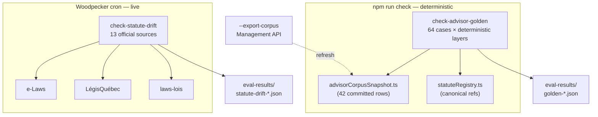

# Advisor Evaluation & Statute Drift

<details>
<summary>Relevant source files</summary>

The following files were used as context for generating this wiki page:

- [src/features/app/advisor/eval/goldenEval.ts](src/features/app/advisor/eval/goldenEval.ts)
- [src/features/app/advisor/eval/goldenCases.ts](src/features/app/advisor/eval/goldenCases.ts)
- [src/features/app/advisor/eval/goldenCases.on.ts](src/features/app/advisor/eval/goldenCases.on.ts)
- [src/features/app/advisor/eval/goldenCases.qc.ts](src/features/app/advisor/eval/goldenCases.qc.ts)
- [src/features/app/advisor/eval/goldenCases.fed.ts](src/features/app/advisor/eval/goldenCases.fed.ts)
- [src/features/app/advisor/eval/goldenCases.x.ts](src/features/app/advisor/eval/goldenCases.x.ts)
- [src/features/app/advisor/eval/statuteRegistry.ts](src/features/app/advisor/eval/statuteRegistry.ts)
- [src/features/app/advisor/eval/statuteDrift.ts](src/features/app/advisor/eval/statuteDrift.ts)
- [src/features/app/advisor/eval/advisorCorpusSnapshot.ts](src/features/app/advisor/eval/advisorCorpusSnapshot.ts)
- [scripts/check-advisor-golden.mjs](scripts/check-advisor-golden.mjs)
- [scripts/check-statute-drift.mjs](scripts/check-statute-drift.mjs)
- [.woodpecker/statute-drift.yml](.woodpecker/statute-drift.yml)
- [supabase/functions/advisor-chat/responsePayload.ts](supabase/functions/advisor-chat/responsePayload.ts)

</details>

The Advisor's correctness is guarded by a **deterministic evaluation layer** — no LLM runs, so the suite is hermetic and can gate `npm run check` on every model/prompt/corpus change. It lives at `src/features/app/advisor/eval/` and comprises three pieces: the **golden eval** (internal consistency), the **statute registry** (what the corpus cites), and the **statute-drift checker** (external consistency — the world changing underneath the corpus).

---

## Golden Eval (`goldenEval.ts`)

`runGoldenEval()` executes every case in the versioned golden set against the same three deterministic layers a real Advisor turn uses:

1. **`detectJurisdictions`** — jurisdiction read from the question text (never assumed; conflict/unknown closes the legal-basis gate)
2. **The committed corpus snapshot** — the same 42 rows `match_advisor_guidance` serves in production, frozen in `advisorCorpusSnapshot.ts` for review
3. **`buildAdvisorResponse` + `crossCheckNoticeFigure`** — the gates, warnings, and statutory-figure cross-check the real turn runs

The golden set is versioned (`GOLDEN_SET_VERSION = '2026-09-30.v1'`) and split by jurisdiction: `goldenCases.on.ts` (24), `.qc.ts` (18), `.fed.ts` (18), `.x.ts` (4 cross-jurisdiction) — **64 cases total**.

### Citation discipline

Per `requiredCitations` ref, the verifier checks:

- The ref **exists in `statuteRegistry`** — a wrong ref is a case defect, not a pass
- `corpus-cited` refs must have an **alias present in the grounding chunk's text** — the Advisor may not lean on a section the corpus doesn't name
- `canonical` refs absent from chunk text are recorded as **coverage gaps** — the answer is grounded but cites at statute level only

A case reports `fail > gap > pass` — a gap case never reports pass.

### What it covers (and doesn't)

The eval is honest about its scope: it tests the **deterministic layers** only. Corpus chunks are selected by jurisdiction+topic match, so the eval can pass while `match_advisor_guidance`'s lexemes miss on a real phrasing — retrieval recall is a known coverage gap, not a defect.

**Runner:** `scripts/check-advisor-golden.mjs` (wired into `npm run check`) runs the suite via vitest and writes a timestamped JSON audit record to `eval-results/` per run. Exit 0 = no failing checks (gaps tolerated); 1 = a failing check; 2 = usage error.

Sources: [src/features/app/advisor/eval/goldenEval.ts:1-46](), [scripts/check-advisor-golden.mjs:1-30](), [src/features/app/advisor/eval/goldenEval.test.ts]()

---

## Statute Registry (`statuteRegistry.ts`)

`STATUTE_REGISTRY` is the canonical list of every statute **ref** the Advisor may cite — each entry pairs a stable ref (`'ON_ESA:57'`, `'FED_CLC:230'`, `'QC_LNT:…'`) with its act, section, and `sourceUrl` to the official consolidated text. The registry serves two purposes:

1. **Golden-eval validation** — every `requiredCitations` ref must resolve here
2. **Drift-check targets** — the `sourceUrl` list is what the drift checker fetches

The corpus uses **citation aliases** — the surface text may name "ESA s.57" while the registry canonical ref is `ON_ESA:57` — and the eval distinguishes `canonical` vs `corpus-cited` refs accordingly.

Sources: [src/features/app/advisor/eval/statuteRegistry.ts:62-110](), [src/features/app/advisor/eval/goldenEval.ts:18-23]()

---

## Corpus Snapshot (`advisorCorpusSnapshot.ts`)

A read-only snapshot of the live `advisor_guidance_chunks` corpus (42 rows), exported via the Supabase Management API. The golden eval grounds every case against this committed snapshot so the suite is deterministic and runs without credentials — corpus changes land as **reviewable diffs**, never silent drift.

Refresh it deliberately with:

```bash
npm run check:advisor-golden -- --export-corpus
```

which pulls the live table via the Management API (`SUPABASE_ACCESS_TOKEN` + `SUPABASE_PROJECT_REF`) and rewrites the snapshot file.

Sources: [src/features/app/advisor/eval/advisorCorpusSnapshot.ts:1-18](), [scripts/check-advisor-golden.mjs:38-60]()

---

## Statute-Drift Checker (`statuteDrift.ts`)

The golden eval proves the corpus is **internally** consistent; it cannot see a statute amendment that lands after a snapshot — a repealed section, a renumbered Part, a changed figure. `statuteDrift.ts` fetches each registry `sourceUrl` and verifies:

1. every registry `section` still exists as a heading in the live text
2. figure-bearing rules still carry their figures (`STATUTE_MARKERS` — e.g. `s.57` must still contain "eight weeks")
3. every section named in a corpus `effective_note` resolves against the act the note names

Sources are the same official sites cited in the registry — **e-Laws** (JSON document API), **LégisQuébec**, and **Justice laws-lois** (`FullText.html`).

### Findings

| `DriftKind`          | Meaning                                                        |
| -------------------- | -------------------------------------------------------------- |
| `section-missing`    | A cited section heading is absent from the live text            |
| `marker-missing`     | A figure-bearing rule lost its figure marker                    |
| `source-unreachable` | The official source could not be fetched                        |
| `cite-missing`       | A corpus `effective_note` section doesn't resolve               |
| `cite-unattributed`  | A cite the parser can't classify (sessional or policy-document) |

### Cadence

The check is **network-bound and intentionally out of `npm run check`** — government sites rate-limit and occasionally interstitial bots, so it belongs to the `.woodpecker/statute-drift.yml` cron/manual pipeline, not the deterministic pre-commit gate. Run it manually via `npm run check:statute-drift`. Exit codes: `0` = every check verified; `1` = drift found; `2` = inconclusive (a source unreachable — nothing verified, nothing drifted).

Latest full run: **122/125 verified, 0 drifted**, 3 `cite-unattributed` parser limitations (a sessional `S.C. 2024, c.15` cite and OHRC policy-document sections — semantically valid).

Sources: [src/features/app/advisor/eval/statuteDrift.ts:1-46](), [scripts/check-statute-drift.mjs:1-40](), [.woodpecker/statute-drift.yml]()

---

## Pipeline Summary



`eval-results/` keeps timestamped JSON audit records per run — dated records stay local (gitignored), and the two `*-latest.json` files (`golden-latest.json`, `statute-drift-latest.json`) are committed as audit evidence.

Sources: [scripts/check-advisor-golden.mjs](), [scripts/check-statute-drift.mjs](), [.gitignore]()

---

## Child Pages

| Page | What it covers |
| ---- | -------------- |
| [AI Advisor System](AI-Advisor-System) | The production Advisor pipeline this layer evaluates |
| [Advisor Safety Guardrails](Advisor-Safety-Guardrails) | The deterministic safety gates the eval exercises |
| [Advisor Edge Function Response Contract](Advisor-Edge-Function-Response-Contract) | The `AdvisorResponse` payload the eval asserts on |
| [Law Change Monitor](Law-Change-Monitor) | The sibling monitor for statute *text* changes (not citation drift) |
