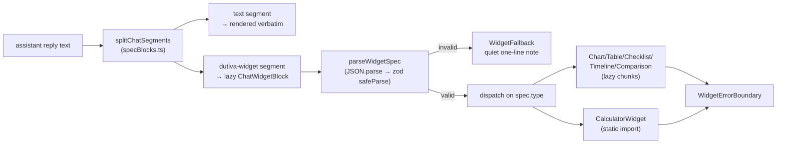

# Chat Widgets (`dutiva-widget`)

Relevant source files

The following files were used as context for generating this wiki page:

- [src/components/chatWidgets/WidgetContent.tsx](src/components/chatWidgets/WidgetContent.tsx)
- [src/components/chatWidgets/ChatWidget.tsx](src/components/chatWidgets/ChatWidget.tsx)
- [src/components/chatWidgets/widgetSpec.ts](src/components/chatWidgets/widgetSpec.ts)
- [src/components/chatWidgets/specBlocks.ts](src/components/chatWidgets/specBlocks.ts)
- [src/components/chatWidgets/fence.ts](src/components/chatWidgets/fence.ts)
- [src/components/chatWidgets/flags.ts](src/components/chatWidgets/flags.ts)
- [src/components/chatWidgets/formula.ts](src/components/chatWidgets/formula.ts)
- [src/components/chatWidgets/formatValue.ts](src/components/chatWidgets/formatValue.ts)
- [src/components/chatWidgets/prebuiltWidgets.ts](src/components/chatWidgets/prebuiltWidgets.ts)
- [src/components/chatWidgets/WidgetErrorBoundary.tsx](src/components/chatWidgets/WidgetErrorBoundary.tsx)
- [src/components/chatWidgets/WidgetFallback.tsx](src/components/chatWidgets/WidgetFallback.tsx)
- [src/components/chatWidgets/chatWidgets.css](src/components/chatWidgets/chatWidgets.css)
- [src/components/advisor/ChatMarkdown.tsx](src/components/advisor/ChatMarkdown.tsx)
- [src/features/app/views/chatwidgets/ChatWidgetsView.tsx](src/features/app/views/chatwidgets/ChatWidgetsView.tsx)
- [src/features/app/views/chatwidgets/demoSpecs.ts](src/features/app/views/chatwidgets/demoSpecs.ts)
- [src/features/invest/portal/InvestChatPage.tsx](src/features/invest/portal/InvestChatPage.tsx)
- [src/features/health/portal/HealthChatPage.tsx](src/features/health/portal/HealthChatPage.tsx)
- [src/features/pr/portal/PrChatPage.tsx](src/features/pr/portal/PrChatPage.tsx)
- [src/app/appViews.tsx](src/app/appViews.tsx)

Chat widgets ("Intelligent UI") let an assistant reply carry **structured, interactive cards** instead of text alone. A bot opts a reply in by emitting a fenced block tagged `dutiva-widget` containing a JSON **widget spec**; the chat surfaces that have the feature flag enabled split the reply into text and spec segments, validate each spec against a Zod schema, and render the matching vetted component.

The spec schema is the security boundary: **no widget type receives raw markup, a URL, or executable code** — it admits data only. Invalid JSON or a spec that fails validation renders a quiet one-line `WidgetFallback` note, so a malformed fence degrades gracefully instead of breaking the message.

Sources: [src/components/chatWidgets/fence.ts:1-9](), [src/components/chatWidgets/ChatWidget.tsx:7-20](), [src/components/chatWidgets/widgetSpec.ts:286-310]()

---

## Feature Flag (`interactiveChatWidgets`)

Widgets only parse on surfaces the flag covers — off, a `dutiva-widget` fence renders as a plain code block exactly as before the feature existed. The flag resolves first-non-empty from:

1. `localStorage['dutiva:flag:interactiveChatWidgets']` — a dev/demo override that flips the flag on a deployed build without a rebuild
2. `VITE_INTERACTIVE_CHAT_WIDGETS` at build time

Values: `"1"` / `"true"` / `"all"` enables every surface; otherwise a **comma-separated surface list** (`"advisor,invest,health,pr"`) enables just those, so each chatbot opts in independently.

| Surface   | Chat surface          | Entry point                                   |
| --------- | --------------------- | --------------------------------------------- |
| `advisor` | Workspace Advisor     | `ChatMarkdown` fence override                 |
| `invest`  | Tally (`/invest`)     | `WidgetContent` in `InvestChatPage`           |
| `health`  | Mira (`/health`)      | `WidgetContent` in `HealthChatPage`           |
| `pr`      | Paige (`/pr`)         | `WidgetContent` in `PrChatPage`               |

Sources: [src/components/chatWidgets/flags.ts:1-36](), [src/components/advisor/ChatMarkdown.tsx:241-263](), [src/features/invest/portal/InvestChatPage.tsx:185-285]()

---

## Rendering Pipeline

Two paths parse fences:

- **`WidgetContent`** — the plain-text portal chats. `useMemo` splits the reply into `{kind:'text'|'widget'}` segments; each widget segment lazy-loads `ChatWidgetBlock`. Only assistant turns render through it — **user text is never parsed**.
- **`ChatMarkdown`** — the Advisor's markdown renderer overrides the code-fence handler: a `dutiva-widget` fence becomes a `ChatWidgetBlock` when the flag covers `advisor`.

**Streaming.** `hideIncompleteWidgetFence` hides an unclosed trailing `dutiva-widget` fence until its closer lands, so half-parsed JSON never flashes during SSE streaming. `ChatMarkdown` applies the same rule.

**Lazy loading.** `CalculatorWidget` is the only statically imported widget — it's small and the most common case. Chart/Table/Checklist/Timeline/Comparison each lazy-load so a reply with one widget type doesn't pay for all six, and the `chatWidgets` code (zod + components) is only fetched when a fence actually renders.

Sources: [src/components/chatWidgets/WidgetContent.tsx:6-45](), [src/components/chatWidgets/specBlocks.ts](), [src/components/chatWidgets/ChatWidget.tsx:16-91](), [src/components/advisor/ChatMarkdown.tsx:241-310]()

---

## The Six Widget Types

`widgetSpecSchema` is a `z.discriminatedUnion('type', …)` — six strict-object specs. Every visible string is an `LText` (`{en,fr}` or a plain string), so every widget renders bilingually through the viewer's current language.

| Type         | Component            | Purpose                                                        | Key schema bounds                                                        |
| ------------ | -------------------- | -------------------------------------------------------------- | ------------------------------------------------------------------------ |
| `calculator` | `CalculatorWidget`   | Numeric estimator with editable inputs + live result           | 1–8 inputs; `formula` is a bounded expression (depth + node caps, refs must be declared inputs); optional ≤4 breakdown rows; `regulated` flag forces an "estimate — verify" line |
| `chart`      | `ChartWidget`        | `bar` or `pie` chart over labelled values                      | 1–12 items; pie items must be non-negative                                |
| `table`      | `TableWidget`        | Small tabular data                                             | 1–8 columns; 1–500 rows; cells are string/number/LText ≤200 chars        |
| `checklist`  | `ChecklistWidget`    | Interactive check-off list                                     | 1–60 items; unique item ids                                               |
| `timeline`   | `TimelineWidget`     | Ordered events/steps                                           | 2–14 steps, optional date labels                                          |
| `comparison` | `ComparisonWidget`   | Side-by-side option cards                                      | strict-object spec, LText labels                                         |

### Calculator formulas

The calculator's `formula` is a parsed expression tree (`formula.ts`), not `eval` — `formulaDepth` and `formulaNodeCount` enforce budgets, and a `superRefine` rejects any formula referencing an undeclared input key. `formatSpecSchema` controls currency/number formatting on the result; breakdown rows are raw quantities unless they declare their own format. The `regulated` flag puts a standing "estimate — verify" line under regulated calculations (termination pay, overtime), because statutory figures move.

### Prebuilt specs

`prebuiltWidgets.ts` ships typed factory functions for the two HR examples in the catalogue — `ontarioTerminationPaySpec()` and `ontarioOvertimeSpec()` — so tests can pin ESA math to a canonical spec. A bot emitting the same JSON gets the identical widget.

Sources: [src/components/chatWidgets/widgetSpec.ts:72-282](), [src/components/chatWidgets/formula.ts](), [src/components/chatWidgets/prebuiltWidgets.ts:1-40]()

---

## Validation & Fallback

- `parseWidgetSpec` = `JSON.parse` → `widgetSpecSchema.safeParse` → `null` on any failure (bad JSON, unknown `type`, missing fields, out-of-bounds values).
- `WidgetFallback` renders a quiet one-line note for invalid specs — no error UI, no raw JSON leak.
- `WidgetErrorBoundary` catches render exceptions inside a widget so a broken widget can't take down the whole message.
- Render telemetry is a dev-only `console.debug` naming the widget **type** — never spec contents; server-side render analytics are a deliberate non-goal for v1.

Sources: [src/components/chatWidgets/widgetSpec.ts:306-310](), [src/components/chatWidgets/WidgetFallback.tsx](), [src/components/chatWidgets/WidgetErrorBoundary.tsx](), [src/components/chatWidgets/ChatWidget.tsx:39-48]()

---

## Demo / Reviewer Route

`ChatWidgetsView` at `/app/chat-widgets` (also `/demo/chat-widgets` and `/fr/demo/chat-widgets`) is an **unlinked showcase route** — it renders every widget type from `demoSpecs.ts` plus mixed-reply and broken-spec fallbacks, so a reviewer can see the whole catalogue and each surface's flag status in one place without flipping a flag.

Sources: [src/features/app/views/chatwidgets/ChatWidgetsView.tsx:19-75](), [src/app/appViews.tsx:307-309]()

---

## Child Pages

| Page | What it covers |
| ---- | -------------- |
| [Portal Assistants](Portal-Assistants) | Mira, Paige, Tally — the three chat surfaces that render widgets |
| [AI Advisor System](AI-Advisor-System) | The workspace Advisor's chat surface (`ChatMarkdown` path) |
| [Advisor Chat Interface & Demo Flows](Advisor-Chat-Interface-Demo-Flows) | Advisor chat UI including markdown/fence rendering |
