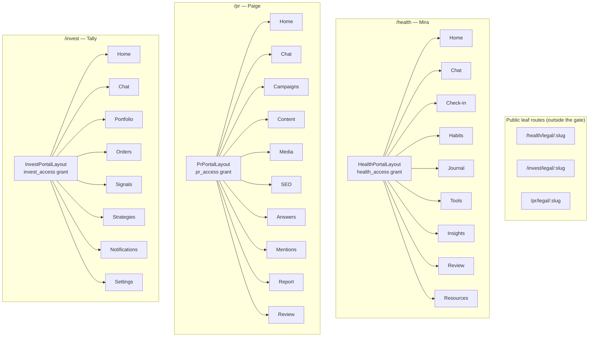

# Portal Assistants (Mira, Paige, Tally)

Relevant source files

The following files were used as context for generating this wiki page:

- [src/app/routes.tsx](src/app/routes.tsx)
- [src/app/healthSurface.tsx](src/app/healthSurface.tsx)
- [src/app/investSurface.tsx](src/app/investSurface.tsx)
- [src/app/prSurface.tsx](src/app/prSurface.tsx)
- [src/features/health/data/api.ts](src/features/health/data/api.ts)
- [src/features/health/data/types.ts](src/features/health/data/types.ts)
- [src/features/health/portal/HealthChatPage.tsx](src/features/health/portal/HealthChatPage.tsx)
- [src/features/invest/portal/InvestChatPage.tsx](src/features/invest/portal/InvestChatPage.tsx)
- [src/features/pr/portal/PrChatPage.tsx](src/features/pr/portal/PrChatPage.tsx)
- [supabase/functions/health-ai/index.ts](supabase/functions/health-ai/index.ts)
- [supabase/functions/health-ai/runtime.ts](supabase/functions/health-ai/runtime.ts)
- [supabase/functions/health-ai/handlers.ts](supabase/functions/health-ai/handlers.ts)
- [supabase/functions/pr-ai/index.ts](supabase/functions/pr-ai/index.ts)
- [supabase/functions/pr-ai/runtime.ts](supabase/functions/pr-ai/runtime.ts)
- [supabase/functions/pr-ai/handlers.ts](supabase/functions/pr-ai/handlers.ts)
- [supabase/functions/invest-ai/index.ts](supabase/functions/invest-ai/index.ts)
- [supabase/functions/invest-ai/runtime.ts](supabase/functions/invest-ai/runtime.ts)
- [supabase/functions/invest-ai/chatActions.ts](supabase/functions/invest-ai/chatActions.ts)
- [supabase/functions/invest-bot/index.ts](supabase/functions/invest-bot/index.ts)
- [supabase/functions/health-habit-notify/index.ts](supabase/functions/health-habit-notify/index.ts)
- [supabase/functions/invest-market-sync/index.ts](supabase/functions/invest-market-sync/index.ts)
- [supabase/functions/pr-fetch-meta/index.ts](supabase/functions/pr-fetch-meta/index.ts)
- [supabase/functions/pr-geo-check/index.ts](supabase/functions/pr-geo-check/index.ts)
- [supabase/functions/pr-mentions-feed/index.ts](supabase/functions/pr-mentions-feed/index.ts)
- [src/components/chatWidgets/WidgetContent.tsx](src/components/chatWidgets/WidgetContent.tsx)
- [src/components/chatWidgets/flags.ts](src/components/chatWidgets/flags.ts)

Beyond the workspace Advisor, Dutiva ships **three standalone, invite-only portals**, each with its own named assistant, its own shell, its own data model, and its own edge function. These are separate surfaces from `/app` — separate layouts, separate access grants, separate persistence — sharing only the auth provider, the i18n system, and the chat-widget renderer.

| Portal | Route  | Assistant | Voice | Edge function | Access grant   | Chat table               |
| ------ | ------ | --------- | ----- | ------------- | -------------- | ------------------------ |
| Health | `/health` | **Mira**  | Warm, non-clinical emotional companion | `health-ai` | `health_access` | `health_chat_messages` |
| PR     | `/pr`     | **Paige** | Media-literate press-office specialist | `pr-ai`     | `pr_access`     | `pr_chat_messages`     |
| Invest | `/invest` | **Tally** | Plain, numbers-first watch clerk       | `invest-ai` | `invest_access` | `invest_chat_messages` |

A fourth standalone surface — the candidate portal at `/careers/portal` — uses `candidate-ai` and `candidate-job-agent` (external job-board discovery); it is a B2C surface with a different metering model (a per-day call rail instead of grants) and is covered under [Edge Functions & Shared Modules](Edge-Functions-Shared-Modules). Besides the one-shot task features (résumé tailoring, cover letters, match scoring, interview prep), `candidate-ai` also serves **Claire**, the search coach — `kind: 'chat'` over the caller's profile, applications, agent-discovered jobs, and agent settings, with turns persisted to `candidate_chat_messages` (0209) under the same `kind`-dispatched contract as the other assistants. Claire is deliberately read-and-advise only: she points at the profile editor, the apply page, or the agent card but writes nothing herself — no action grammar exists for this surface.

Sources: [src/app/routes.tsx:390-478](), [src/app/healthSurface.tsx:1-16](), [supabase/functions/health-ai/index.ts](), [supabase/functions/pr-ai/index.ts](), [supabase/functions/invest-ai/index.ts]()

---

## Surface Architecture

Each portal is a top-level route branch wrapped in its own lazily-loaded surface component (`HealthPortalSurface`, `InvestPortalSurface`, `PrPortalSurface`). The surfaces share `AuthProvider` + `LangProvider` + `ToastsProvider` but render **their own shells** — no `AppShell` sidebar, no workspace mode, no demo mode. All are invite-only and all are `noindex` except their public legal pages.

The grant check is server-side and fail-closed: the edge function reads `health_access` / `pr_access` / `invest_access` through the **service-role client** after validating the caller's JWT — a missing row returns `403` (`code: 'no_access'`). The layout mirrors the same check client-side to render a sign-in wall (with `PrAuthPanel` / `HealthAuthPanel` / `InvestAuthPanel`) instead of the portal.

Sources: [src/app/routes.tsx:390-478](), [supabase/functions/health-ai/index.ts:85-103](), [supabase/functions/invest-ai/index.ts:78-96](), [src/features/health/data/api.ts:29-44]()

---

## The Shared Chat Contract

All three assistants implement the same `kind`-dispatched request contract, so the portal front-ends share one mental model:

| `kind`           | Purpose                                                                                              |
| ---------------- | ---------------------------------------------------------------------------------------------------- |
| `chat`           | Send a message → `{ reply, action, assistantId }`. May execute a whitelisted write (below).         |
| `react`          | The assistant reacts to a UI event the person just did (saved a check-in, logged a mention, watched a symbol). Persisted like a chat turn. |
| `chat_history`   | Read back persisted turns (`limit`).                                                                  |
| `chat_clear`     | Clear the caller's conversation.                                                                     |
| `chat_feedback`  | Thumbs up/down (`rating: 1 | -1 | 0`) on one assistant message.                                       |
| `chat_undo`      | Reverse the action an assistant turn executed, while still reversible.                                |

Two contract rules hold on every surface:

- **The function is the table's only writer** — history read, clear, and feedback all run through the edge function rather than direct table access from the client.
- **Both turns persist** — the user's message and the assistant's reply land in `*_chat_messages` together, so history survives reloads and `chat_undo` can find the row it needs to reverse.

Mira adds two kinds on top: `entry_react` (respond to one journal entry the person explicitly shared via "Let Mira read this") and one-shot prompt kinds (`reflect`, `recap`, `habit`). Paige adds one-shot desk kinds (`tone`, `draft`, `summary`, `clusters`, `prompts`, `pitch`). Tally adds `draft-strategy` (a one-shot action, not a `kind`).

Sources: [supabase/functions/health-ai/index.ts:24-62](), [supabase/functions/pr-ai/index.ts:35-71](), [supabase/functions/invest-ai/index.ts:24-50]()

### Streaming

`stream: true` on the model kinds switches the response to `text/event-stream`. `{"type":"delta","text":…}` events carry reply text as it generates — **never the action JSON** — then one `{"type":"done",…}` event carries the full payload the non-streaming shape would return. Mid-stream failures arrive as `{"type":"error"}`.

Sources: [supabase/functions/health-ai/index.ts:63-68](), [supabase/functions/pr-ai/index.ts:72-77](), [supabase/functions/invest-ai/index.ts:51-56]()

### Whitelisted Actions

Chat turns may return an `action` the function executes against the **caller's own rows** — additive or reversible writes only:

| Assistant | Whitelisted actions |
| --------- | ------------------- |
| **Mira** (`health-ai/runtime.ts`) | `mark_habit_done`, `unmark_habit_done`, `add_habit`, `add_checkin`, `add_journal_entry` |
| **Paige** (`pr-ai/runtime.ts`) | `add_campaign`, `update_campaign_status`, `add_content_item`, `add_media_contact`, `add_mention`, `add_keyword`, `add_geo_prompt` |
| **Tally** (`invest-ai/chatActions.ts`) | `add_watch_symbol`, `remove_watch_symbol`, `create_order`, `update_signal`, `add_position`, `draft_strategy` |

`chat_undo` reverses the write while it's still reversible — unmark a habit, delete the row an `add_*` created, restore the status `update_signal` replaced, or remove a queued order that hasn't been touched. The executed action's `refId` and undo metadata persist on the assistant message row.

Sources: [supabase/functions/health-ai/runtime.ts:310-340](), [supabase/functions/invest-ai/chatActions.ts:46-240](), [supabase/functions/pr-ai/runtime.ts]()

### Reactions

`react` events let the assistant speak outside the chat box: Mira reacts when the person saves a check-in or finishes a habit, Paige when a mention is logged or a draft saved, Tally when a symbol is watched or an order queued. Reaction lines persist to the same `*_chat_messages` table and render in the chat thread. Client-side throttling (`resetHealthReactionThrottle` and peers) bounds how often reactions fire.

Sources: [src/features/health/data/api.ts:337-370](), [supabase/functions/pr-ai/index.ts:52-58](), [supabase/functions/invest-ai/index.ts:40-42]()

### Chat widgets

All three portal chats can render [`dutiva-widget` fenced specs](Chat-Widgets) inline when `interactiveChatWidgetsEnabled(surface)` covers them — surfaces `'invest'`, `'health'`, `'pr'`. Off, the fence renders as a plain code block. See [Chat Widgets](Chat-Widgets).

Sources: [src/features/invest/portal/InvestChatPage.tsx:17-25](), [src/features/health/portal/HealthChatPage.tsx:18-24](), [src/components/chatWidgets/flags.ts:19-36]()

---

## Mira — `/health` (health-ai)

Mira is the wellness portal's companion: a warm, non-clinical presence over the person's own check-ins, habits, journal, and conversation. She is deliberately **not** clinical — her system prompt bars diagnosis, illness, treatment, medication, therapy, and crisis content beyond a single resource line.

**One-shot kinds** (beyond the shared chat contract):

| `kind`        | Returns      | Purpose                          |
| ------------- | ------------ | -------------------------------- |
| `reflect`     | `{ prompt }` | One gentle journal prompt        |
| `recap`       | `{ summary}` | Short weekly summary             |
| `habit`       | `{ habit }`  | One habit suggestion             |
| `entry_react` | `{ reply }`  | Respond to one shared entry      |

**Privacy posture.** Mira reads only what the caller wrote — check-in notes and **bounded excerpts of journal entries the person explicitly shared** (`shared_at` is enforced again in `buildCompanionSignals` after the query, not just in the query filter). Unshared entries never reach the prompt. Every row belongs to the caller; nothing is shared across users.

**Crisis handling.** If a message, check-in, or shared entry hints at crisis or self-harm, Mira is instructed to reply **only** with supportive words plus `"Call or text 9-8-8 (Canada, 24/7) — or 911 if you are in immediate danger."` — no check-in is logged, no entry written, no action executed.

**Companion cron.** `health-habit-notify` runs daily (pg_cron 23:00 UTC, migration 0196): for each habit with a live streak not yet checked off, the owner gets one gentle email — non-clinical, no shame language.

Sources: [supabase/functions/health-ai/index.ts:70-80](), [supabase/functions/health-ai/handlers.ts:99-115](), [supabase/functions/health-ai/handlers.ts:330-340](), [src/features/health/data/types.ts:22-45](), [supabase/functions/health-habit-notify/index.ts]()

---

## Paige — `/pr` (pr-ai)

Paige is the press-office specialist: media-literate, desk-oriented, and strictly **suggestive** — she drafts and logs, she never publishes or sends anything.

**One-shot kinds:**

| `kind`      | Returns              | Purpose                                             |
| ----------- | -------------------- | --------------------------------------------------- |
| `tone`      | `{ sentiment }`      | Classify a mention's sentiment                      |
| `draft`     | `{ draft }`          | Draft a content item into the edit field            |
| `summary`   | `{ intro }`          | Monthly report intro from stats                     |
| `clusters`  | `{ clusters }`       | Cluster coverage items by theme                     |
| `prompts`   | `{ prompts }`        | Suggest GEO-tracking prompts                        |
| `pitch`     | `{ subject, pitch }` | Draft a media pitch for a contact                   |

Input hygiene is enforced before prompting: `MAX_TITLE_CHARS` 500, `MAX_NOTES_CHARS` 2000, `MAX_STATS_CHARS` 4000, `MAX_CLUSTER_ITEMS` 24, `MAX_LIST_ITEMS` 30.

**Model routing.** `pr-ai` resolves the `pr_ai` model route first, falling back to `advisor_chat` — the shared `aiRoute` helper lets ops point Paige at a different model without a deploy.

**Desk helpers (separate functions).** `pr-fetch-meta` fetches a pasted URL's metadata server-side (browsers can't — CORS), `pr-geo-check` runs tracked GEO prompts through the model route and records brand mentions, and `pr-mentions-feed` polls the RSS/Atom feeds a user saved (Google Alerts, outlet feeds) into `pr_mentions`.

Sources: [supabase/functions/pr-ai/index.ts:33-87](), [supabase/functions/pr-ai/handlers.ts](), [supabase/functions/pr-fetch-meta/index.ts](), [supabase/functions/pr-geo-check/index.ts](), [supabase/functions/pr-mentions-feed/index.ts]()

---

## Tally — `/invest` (invest-ai + invest-bot)

Tally is the book's watch clerk — plain, precise, numbers before adjectives. The invest portal is a paper ledger, not brokerage: she records intent and drafts, never fills, and **never gives investment advice to external accounts**.

**Safety contract (the prompt's HARD LINE):** for external accounts, nothing here is investment advice, a recommendation, or a prediction — never tell the user to buy, sell, or hold; never promise returns; never call an order, holding, or allocation "good", "safe", or "right for them". Tally describes what the book shows, may discuss general concepts and approaches, and says plainly when the person seems to want a registered professional. For a verified `@dutiva.ca` sign-in the register loosens to direct advice on the book — see the internal-staff tier below.

**Draft-strategy split.** The model *authors* strategy drafts (`draft-strategy`); the deterministic **`invest-bot`** engine executes them. A draft is validated server-side, returned disabled, and only reaches the book after the user reviews and saves it — the model cannot arm a live strategy.

**invest-bot actions** (deterministic engine, not a chat surface):

| `action`         | Auth                                 | Effect                                                        |
| ---------------- | ------------------------------------ | ------------------------------------------------------------- |
| `run`            | Portal JWT                           | Scan the caller's strategies now (manual scans ignore cadence) |
| `run-all`        | Service key / trigger secret, or portal JWT with `role='admin'` | Cadence-gated nightly sweep   |
| `test-scan`      | Portal JWT                           | Dry-run diagnostics for a draft strategy — writes nothing     |
| `execute-order`  | Portal JWT                           | **The only fill path** — executes a draft/queued paper order at the snapshot price, or confirms a live order |

Order-proposal rules emit **draft** orders that wait in the Orders tab for explicit user approval. `chat_undo` can reverse a queued order only while untouched.

**Market data.** `invest-market-sync` refreshes `invest_market_snapshots` from free public feeds and stores shared headlines in `invest_market_news`, so strategies evaluate fresh prices without manual entry.

Sources: [supabase/functions/invest-ai/index.ts:24-56](), [supabase/functions/invest-ai/handlers.ts:215-240](), [supabase/functions/invest-ai/handlers.ts:398-434](), [supabase/functions/invest-bot/index.ts:17-45](), [supabase/functions/invest-market-sync/index.ts]()

---

## Shared Plumbing

| Concern              | Implementation                                                                                                  |
| -------------------- | --------------------------------------------------------------------------------------------------------------- |
| Auth                 | Portal contract only — bearer JWT + the surface's `*_access` grant via service-role; no scheduled/chat cross-path |
| Model upstream       | `postChatCompletion` in `_shared/modelUpstream.ts`, `UPSTREAM_TIMEOUT_MS` per function                          |
| Model routing        | `_shared/aiRoute.ts` `modelRoute()` — `health_ai` / `pr_ai` / `invest_ai` keys, `advisor_chat` fallback for pr-ai |
| Suggestion queue     | `fileSuggestion` + `textDedupeKey` in `_shared/agentQueue.ts` — assistants file suggestions, never act silently  |
| CORS                 | `withCors` in `_shared/cors.ts`                                                                                  |
| Undo/feedback storage | `action`/`refId`/undo metadata columns on each `*_chat_messages` row                                            |
| Bilingual            | `lang?: 'en' \| 'fr'` on every kind; prompts build per-language server-side                                      |

Sources: [supabase/functions/_shared/aiRoute.ts](), [supabase/functions/_shared/agentQueue.ts](), [supabase/functions/_shared/modelUpstream.ts](), [supabase/functions/health-ai/index.ts:24-82]()

### Internal-staff tier (@dutiva.ca)

Every AI surface runs one extra server-side check on the caller's auth email: `isInternalDutivaAccount` (`_shared/adminAccess.ts`, the same domain check the billing and admin paths use). A verified `@dutiva.ca` sign-in swaps the generic/no-advice register for a direct-advice one — Tally and the bot's insight pass may recommend trades on the book, Mira may advise plainly instead of only observing, Paige may advise like a desk editor who owns the call, Claire coaches to a verdict instead of pointing at the AI tools, and the workspace Advisor answers "what should I do" with a recommendation instead of a boundary. What never changes: the access grants (`*_access` still required), the write whitelists, the queued-draft order rule, the non-clinical boundary in Health, the never-publish line in PR, and "software, not a person" honesty. Invest-bot's `run-all` sweep resolves each user's auth email via `auth.admin.getUserById` — the tier applies to scheduled insight runs too.

Sources: [supabase/functions/_shared/adminAccess.ts](), [supabase/functions/invest-ai/index.ts](), [supabase/functions/invest-bot/runs.ts](), [supabase/functions/advisor-chat/completion.ts](), [supabase/functions/health-ai/index.ts](), [supabase/functions/pr-ai/index.ts]()

---

## Child Pages

| Page | What it covers |
| ---- | -------------- |
| [Chat Widgets](Chat-Widgets) | The `dutiva-widget` spec system all three portal chats can render |
| [Edge Functions & Shared Modules](Edge-Functions-Shared-Modules) | Full function inventory incl. `candidate-ai`, cron workers |
| [Advisor Evaluation & Statute Drift](Advisor-Evaluation-Statute-Drift) | The deterministic eval/drift harness for the workspace Advisor |
